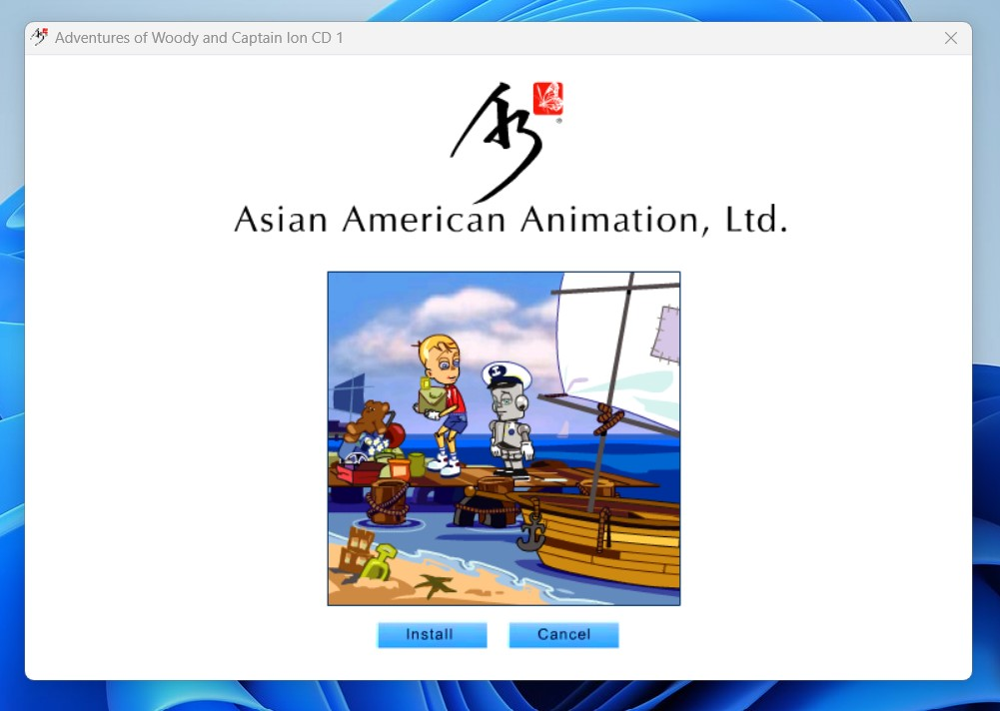

# A3 Autoplay Launcher

This project was used as an autoplay launcher for a series of educational, interactive movies produced by Asian American Animation, Ltd from approximately 2008 - 2011. It was developed in Visual Basic 6 since Microsoft has a [generous support policy](https://learn.microsoft.com/en-us/previous-versions/visualstudio/visual-basic-6/visual-basic-6-support-policy) for non-complex applications written with the language. This support, coupled with no dependencies on third-party libraries, meant that a wide range of systems could execute the autoplay launcher without trouble.

In particular, the launcher would:
* Install Flash (silently)
* Install .Net Framework 2.0 (silently)
* Launch the setup program *or* the installed application, if found on the system

It has been uploaded and archived to GitHub for posterity. The [provided license](SOURCECODE-LICENSE) applies only to the project's sourcecode *and* not any included media assets.

